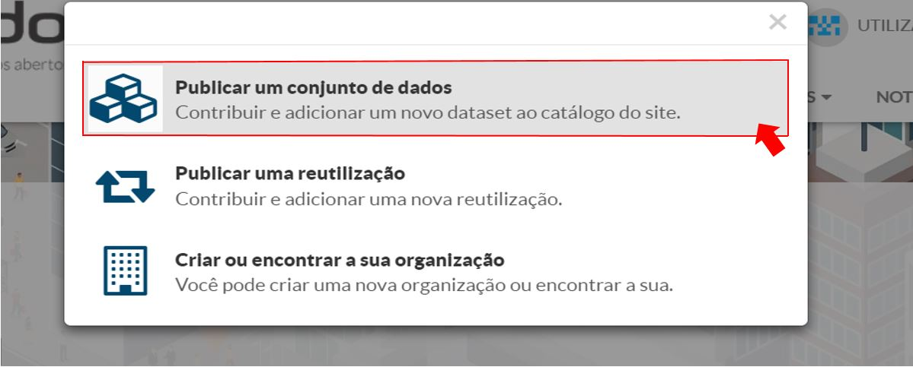

# Gestão de Conteúdos

Esta secção explica alguns dos princípios básicos sobre a publicação e acesso às funcionalidades dos conteúdos abertos no portal.

Para ter acesso a todas estas funcionalidades terá de efectuar o seu registo e/ou iniciar sessão. Para saber mais consulte ‘link para a secção Registo de Utilizador’.

## Conjuntos de Dados 

Publicar um conjunto de dados

1. Clicar em ‘Contribuir!’ no seu frontend ou em ‘+’ na administração;

2.	Selecionar ‘Publicar um conjunto de dados’ ou ‘Adicionar um conjunto de dados’;

3.	Escolher sob qual a identidade deseja publicar o conjunto de dados;

4.	Preencher os campos do formulário:

    a. Licença: 
    Selecionar a licença que mais se adequa ao conjunto de dados. Para mais informações consulte     (https://dados.gov.pt/pt/docs/licenses/).
    
    b. Etiquetas:
    Adicionar as etiquetas que mais se adequam ao conjunto de dados que serão indexadores do mesmo. Poderá adicionar etiquetas novas ou         selecionar as que já existem que poderão ser dadas como sugestão à medida que vai inserido palavras no campo respetivo.
    
    
    
    c. Cobertura espacial:
    Este campo serve para referir a cobertura geográfica referente ao conjunto de dados. Deve referir zonas geográficas, tais como: países, distritos, concelhos ou freguesias que mais se adequam ao seu conjunto de dados de modo a que a mesma seja explícita e o menos redundante possível.
    
5.	Escolher o tipo de ficheiro do recurso que quer adicionar ao conjunto de dados.
     
## Organizações

Uma organização é uma entidade responsável pela disponibilização de conjuntos de dados  e organização dos mesmos.

Publicar uma organização

1.	Clicar em ‘Contribuir!’ no seu frontend ou em ‘+’ na administração ;

2.	Selecionar ‘Criar ou encontrar a sua organização’ ou ‘Adicionar uma organização’;

3.	Verificar se a organização que deseja publicar não se encontra já inserida no portal;

4.	Preencher os campos do formulário:

    a.	Sigla:
    No caso dessa organização ser atualizada por um harvester a sigla deve coincidir com a providenciada na fonte do mesmo. 

5.	Escolher um logótipo para a organização.

Adicionar certificados a uma organização (ADMIN):

 

                          1. Clicar na opção ‘Editar’ na página de perfil da organização ou pesquise a mesma na                administração e selecione-a;

                          

        2. Selecionar ‘Emblemas’;
        
        
        c.	Reutilizações
Publicar uma reutilização:
1.	Clicar em ‘Contribuir!’ no seu frontend ou em ‘+’ na administração;

 

 

2.	Selecionar ‘Publicar uma reutilização’ ou ‘Adicionar uma reutilização’;

 

 

3.	Escolher sob qual a identidade deseja publicar a reutilização;

4.	Preencher os campos do formulário:
a.	URL:
Representa o repositório/endereço de alojamento da reutilização.

5.	Pesquisar e selecionar os conjuntos de dados a relacionar à reutilização;

6.	Escolher uma imagem para a reutilização.

d.	Temas (Admin)

Publicar um tema:

1.	Clicar em ‘+’ na administração;

2.	Selecionar ‘Adicionar um tema’;

 
3.	Preencher os campos do formulário:
a.	Etiquetas:
O dados.gov seleciona os conjuntos de dados que melhor se adequam ao tema, para tal deve apenas selecionar etiquetas relacionadas com o mesmo.

b.	Em Destaque:
Este campo deverá ser selecionado para que o tema fique público no portal.

4.	Adicionar os conjuntos de dados (se existirem) relacionados ao tema;

5.	Adicionar as reutilizações (se existirem) relacionadas ao tema.

Existem também outras funcionalidades para ajudar na gestão dos conteúdos do portal, nomeadamente, editar, transferir ou eliminar.
A edição serve para editar o conteúdo de conjuntos de dados, reutilizações, organizações, temas ou utilizadores. 
   
A transferência permite que um conjunto de dados ou uma reutilização seja transferida para outro utilizador ou outra organização. Para concluir a transferência será sempre necessário que esta seja aceite pelas entidades de destino e, no caso de o destino ser uma organização, o utilizador tem de ser administrador da mesma.
 
Por fim, quando um conteúdo é eliminado do portal o mesmo deixa de estar visível para os outros utilizadores e é associada automaticamente uma etiqueta ‘Eliminado’. O conteúdo continuará a ser visível para o administrador do conteúdo durante 24 horas. Depois disso, o conteúdo será eliminado definitavemente do portal.
 
 

e.	Utilizadores (Admin)
Um ponto importante relativamente à gestão de utilizadores é que existe a possibilidade de adicionar outros utilizadores como administradores. Para isso, basta ir para a edição do utilizador e selecionar a opção ‘admin’ no campo ‘Perfis’.

Para remover o perfil administrador de um utilizador basta realizar o mesmo processo e selecionar a opção ‘admin’ juntamente com a tecla CTRL.

                                           3. Selecionar os certificados que mais se adequam à organização.

