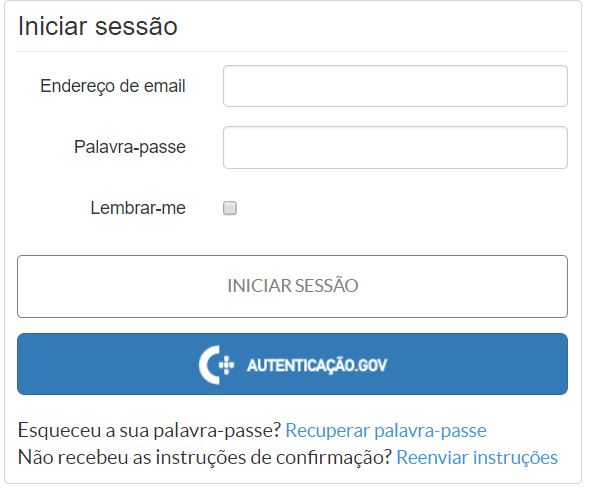
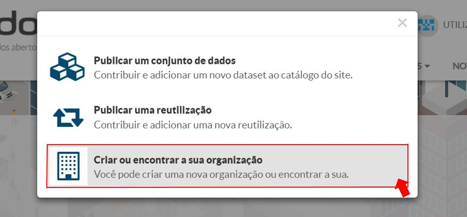
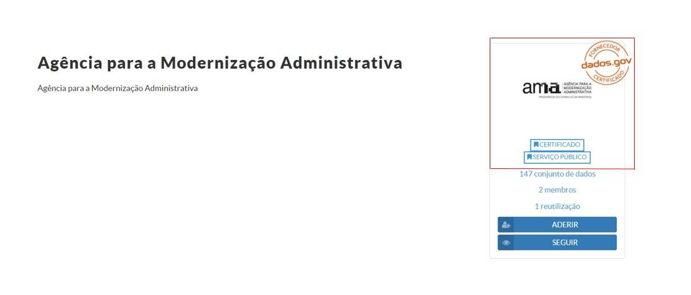
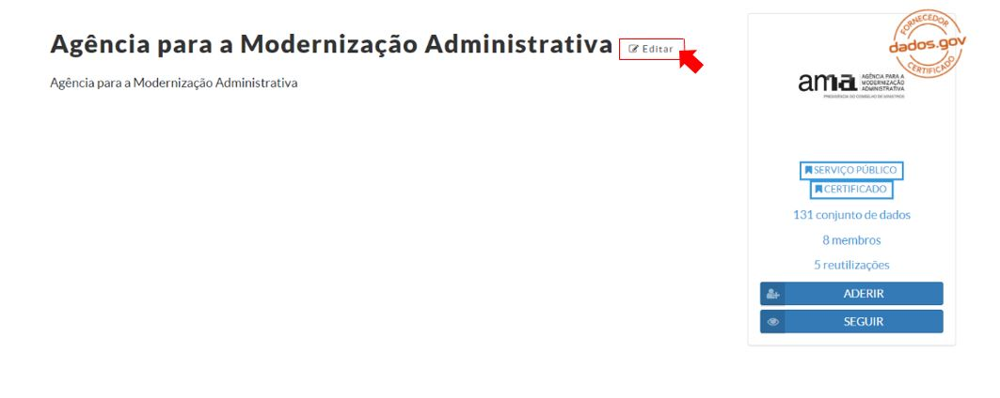
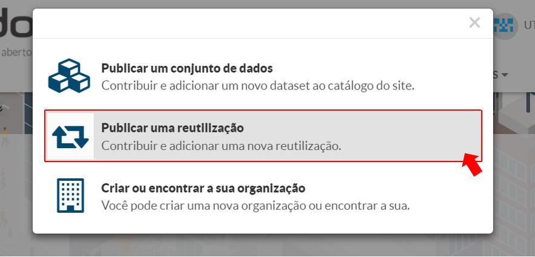

# Gestão de dados, conteúdos e funcionalidades base

Esta secção explica alguns dos princípios básicos sobre a publicação e acesso às funcionalidades dos conteúdos abertos no portal.

- [Conjunto de Dados](#conjuntos-de-dados)
- [Organizações](#organizações)
- [Reutilizações](#reutilizações)

Para ter acesso a todas estas funcionalidades terá de efectuar o seu registo e/ou iniciar sessão. Para saber mais consulte [Registo de Utilizador](#registo-de-utilizador).

## Registo de Utilizador

Para se autenticar no portal dados.gov basta clicar em ‘Entrar/Registar’ e escolher o caso que mais se adequa a si. 

Se ainda não fez o seu registo escolha ‘Criar conta’ e selecione ‘Email/Palavra-passe’ ou ‘Autenticação.Gov’ se pretender utilizar o cartão de cidadão ou a chave móvel digital para fazer a sua autenticação. Uma vez que efectuou o registo receberá no e-mail que inseriu, um link para ativar a sua conta.

Caso contrário, precisa apenas de iniciar sessão com as credênciais respetivas ou via Autenticação.Gov.

## Conjuntos de Dados 

Publicar um conjunto de dados

1. Clicar em ‘Contribuir!’ no seu frontend ou em ‘+’ na administração;

*Vista da Administração*

2.	Selecionar ‘Publicar um conjunto de dados’ ou ‘Adicionar um conjunto de dados’;

*Vista da Administração*

3.	Escolher sob qual a identidade deseja publicar o conjunto de dados;

4.	Preencher os campos do formulário:

    a. Licença: 
    Selecionar a licença que mais se adequa ao conjunto de dados. Para mais informações consulte     (https://dados.gov.pt/pt/docs/licenses/).
    
    b. Etiquetas:
    Adicionar as etiquetas que mais se adequam ao conjunto de dados que serão indexadores do mesmo. Poderá adicionar etiquetas novas ou         selecionar as que já existem que poderão ser dadas como sugestão à medida que vai inserido palavras no campo respetivo.
    
    
    
    c. Cobertura espacial:
    Este campo serve para referir a cobertura geográfica referente ao conjunto de dados. Deve referir zonas geográficas, tais como: países, distritos, concelhos ou freguesias que mais se adequam ao seu conjunto de dados de modo a que a mesma seja explícita e o menos redundante possível.
    
5.	Escolher o tipo de ficheiro do recurso que quer adicionar ao conjunto de dados.

    
## Organizações

Uma organização é uma entidade responsável pela disponibilização de conjuntos de dados  e organização dos mesmos.

Publicar uma organização

1.	Clicar em ‘Contribuir!’ no seu frontend ou em ‘+’ na administração ;

*Vista da Administração*

2.	Selecionar ‘Criar ou encontrar a sua organização’ ou ‘Adicionar uma organização’;

*Vista da Administração*

3.	Verificar se a organização que deseja publicar não se encontra já inserida no portal;

4.	Preencher os campos do formulário:

    a.	Sigla:
    No caso dessa organização ser atualizada por um harvester a sigla deve coincidir com a providenciada na fonte do mesmo. 

5.	Escolher um logótipo para a organização.

Adicionar certificados a uma organização (ADMIN)

 
1. Clicar na opção ‘Editar’ na página de perfil da organização ou pesquise a mesma na administração e selecione-a;

2. Selecionar ‘Emblemas’;

3. Selecionar os certificados que mais se adequam à organização.

## Reutilizações

Publicar uma reutilização

1.	Clicar em ‘Contribuir!’ no seu frontend ou em ‘+’ na administração;

*Vista da Administração*

2.	Selecionar ‘Publicar uma reutilização’ ou ‘Adicionar uma reutilização’;

*Vista da Administração*

3.	Escolher sob qual a identidade deseja publicar a reutilização;

4.	Preencher os campos do formulário:

    a.	URL:
    Representa o repositório/endereço de alojamento da reutilização.

5.	Pesquisar e selecionar os conjuntos de dados a relacionar à reutilização;

6.	Escolher uma imagem para a reutilização.

