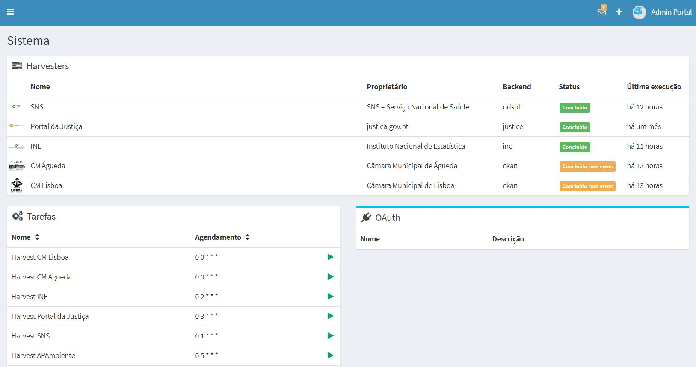

# Harvesters para indexação de dados

Esta secção explica alguns dos princípios básicos sobre a publicação e acesso às funcionalidades dos harvesters no portal.

- [Criar um Harvester para recolha de dados](#criar-um-harvester-para-recolha-de-dados)
- [Gestão de harvesters](#gestão-de-harvesters)

## Criar um Harvester para recolha de dados

A acção de fazer “harvesting” é uma das funcionalidades mais importantes do dados.gov, esta permite indexar e catalogar outros portais de dados abertos.

Criar/agendar uma tarefa de harvesting:

1. Clicar em ‘+’ na administração;

*Vista da administração*

2. Selecionar a opção ‘Adicionar um harvester’;

*Vista da administração*

3. Escolha sob qual identidade deseja publicar (deverá criar previamente, se for o caso, a organização que deseja associar ao harvester);

4. Preencher o formulário:
   
   a. URL: Representa o endereço da organização/serviço a catalogar (para o url ser válido é necessário indexar 'http://' ao mesmo);
  

   *Exemplo: URL do portal de dados abertos da câmara municipal de Lisboa (http://dados.cm-lisboa.pt/)*
   
   
   b. Backend: estabelece o protocolo que é utilizador pelo o portal de origem para a indexação ( DCAT, CKAN, ODS, etc... )
   
   *Exemplo: backend do portal de dados abertos da câmara municipal de Lisboa (http://dados.cm-lisboa.pt/)*
   
 
   
O portal dados.gov adaptou dois backends, respetivamente, CKAN e ODS com extensão PT ( CKAN PT, OpenDataSoftPT ), em que adicionalmente o acto de harvesting vai indexar/criar organizações que estejam associadas ao portal de origem de dados abertos para o dados.gov, caso ainda não estejam criadas. Para evitar duplicados é necessário garantir que o sigla da organização coincida com o da origem.

 
O harvester só ficará válido após a confirmação do administrador do portal.

## Gestão de harvesters

O gerenciamento de harvesters é feito no backend na secção “Sistema” na qual é possivel visualizar o estado, histórico de execução e agendamento, ao selecionar um harvester é possível obter um histórico completo de todas as operações efectuadas bem como perceber se há problemas com a indexação de algum dataset.

 

 

 
